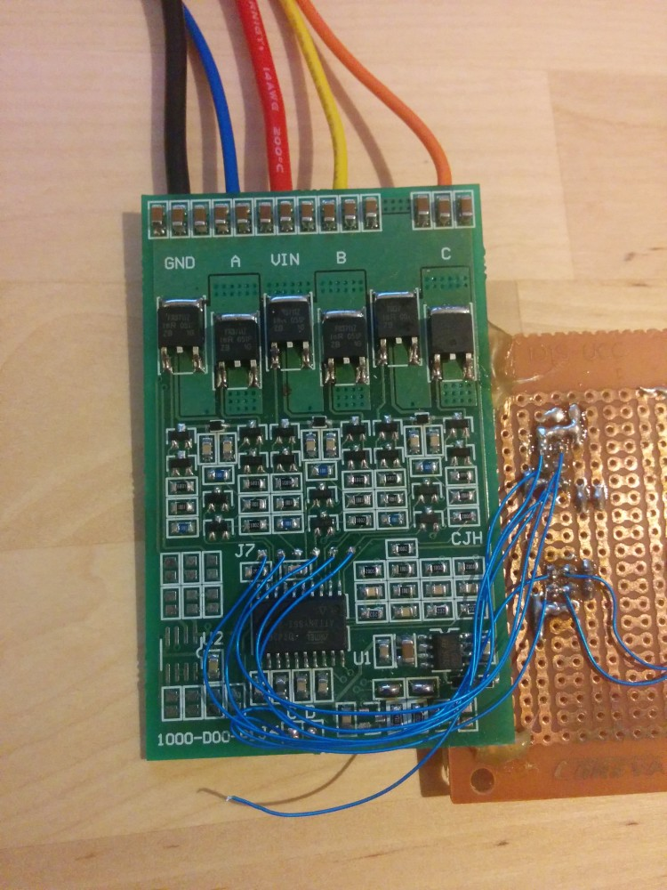

# dev0002: BLDC ESC

Firmware and bootloader for a low-cost BLDC ESC designed for radio controlled multi-rotor applications. The target MCU is the Atmel AVR attiny861.

## Features
* 10bit PWM at 8, 16 or 32KHz (lower or higher if application suits, though there are practical limits and tradeoffs)
* Synchronous rectification
* BEMF position detection
* Hardware based current limiting
* Temperature measurement
* Supply voltage measurement
* 100Kbit two-wire bus for control, configuration and data collection
* Bootloader

## Status of Project
* Bootloader bootloading on prototype hardware.

## Prototype Hardware

[Early prototype schematic](doc/reference_design.pdf)

## Documentation
[PR01 Two-Wire Bridging Protocol](doc/doc0002-0.02.pdf)

[PR02 Two-Wire Transfer Protocol](doc/doc0004-0.01.pdf)

## Communication
### Interface
100Kbit two-wire bus.

This interface is ideal for the following reasons:
* Multidrop
* Built-in addressing
* Bus is clocked by primary station
    * No baud rate negotiation
    * No crystal required on the secondary station
* Low cost
* No spare IO in this design

### Protocol
* PR03; Firmware upload, configuration, general communication.
* Flight protocol; broadcast and unicast modes for delivering throttle settings and retrieving status information.

Multiple protocols are able to exist at the same time through definition of separate address ranges.

## License
BSD.

Cameron Harper 2012
(cam@cjh.id.au) 
